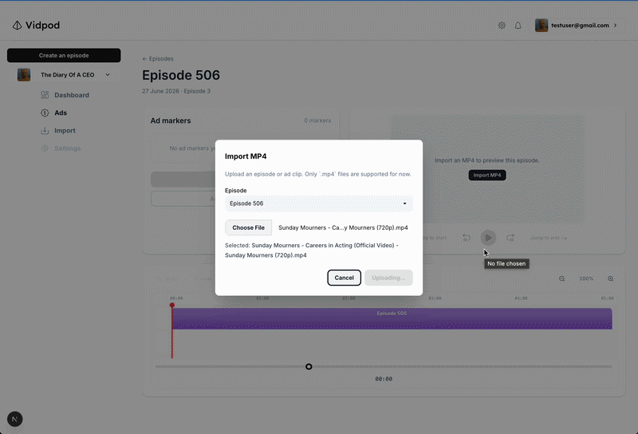

# Flight Story Ads Editor Take Home

Hi Rox! I had a great time building this. I found the project both challenging and rewarding, and I'm excited to share what i've got. I had to take some creative liberties while replicating the figma mockup, namely, the creation of new episodes, how auth is handled, etc. 

## Upload Episodes and Ads



## Table of contents

- [Quick start](#quick-start)
- [Limitations](#limitations)
- [User flow](#user-flow)
- [Architecture & Key Files](#architecture-short)
- [Twick](#twick)
- [Known gaps & nice-to-haves](#known-gaps--nice-to-haves)
- [Tech stack](#tech-stack)
- [Notes for reviewers](#notes-for-reviewers)

---

## Quick start

```bash
git clone https://github.com/mpughcs/VidPodTakehome.git 
npm install
npm run dev
```

Then open [http://localhost:3000](http://localhost:3000).

Sign in with the credentials I provide, create an episode, use **Import** in the sidebar to upload an MP4, and open the episode to land on the ads editor at `/episodes/[id]`.

### Firebase env vars

There is no `.env.example` in this repo. Email me at **[maxgpugh01@gmail.com](mailto:maxgpugh01@gmail.com)** and I’ll send you a `.env.local` with the Firebase keys.

Create `.env.local` at the project root with the values I send you (restart the dev server after any change):

```
NEXT_PUBLIC_FIREBASE_API_KEY=
NEXT_PUBLIC_FIREBASE_AUTH_DOMAIN=
NEXT_PUBLIC_FIREBASE_PROJECT_ID=
NEXT_PUBLIC_FIREBASE_STORAGE_BUCKET=
NEXT_PUBLIC_FIREBASE_MESSAGING_SENDER_ID=
NEXT_PUBLIC_FIREBASE_APP_ID=
```
---

## Limitations

A few intentional constraints for this take-home, especially if I deploy it against live Firebase / Storage:

- **No public sign-up** — Review access is invite-only: sign in with credentials I share, or ask me for a login. Protects paid firebase resources
- **Firebase keys are not in the repo** — see [Firebase env vars](#firebase-env-vars) above; email me for a `.env.local`.
- **Episodes need an imported MP4** before preview and the timeline are useful — otherwise there’s nothing to scrub.
- **A/B mode is preview-only** — no analytics or winner selection yet (see [Known gaps](#known-gaps--nice-to-haves)).

---

## User flow

Here’s the path I had in mind when wiring things up:

1. **Home** — see your episodes, create new ones, delete if you’re in “edit” mode
2. **Import MP4** — sidebar → episode dropdown → **Import** (uploads to Firebase Storage, sets the episode `src`)
3. **Ads editor** (`/episodes/[id]`) — three zones:
   - **Left** — marker list, create marker, auto-place demo markers, edit/delete
   - **Right** — video preview + transport controls
   - **Bottom** — timeline (undo/redo, zoom, scrub, draggable markers)


## Architecture (short)

If you want to jump straight into the code, this is the map:

```
/episodes/[id]          → AdsEditor page
  AdsTimelineProvider   → Twick timeline + React context (markers, playback time, ads)
  InterstitialPreview   → dual <video> (episode + ad), marker-aware playback
  TwickTimelineRenderer → custom timeline UI (no global Twick CSS bleed)
  TimelineMarkerPersistence → Firestore sync when timeline changes (incl. undo/redo)
```

Key files:

| Area | Path |
|------|------|
| Ads editor layout | `src/components/ads-editor/AdsEditor.tsx` |
| Playback | `src/components/ads-editor/InterstitialPreview.tsx` |
| Playback helpers | `src/lib/interstitial-playback.ts` |
| Timeline | `src/components/ads-editor/timeline/TwickTimelineRenderer.tsx` |
| Context | `src/context/AdsTimelineContext.tsx` |
| Marker CRUD | `src/lib/ad-markers-db.ts` |
| Ad library | `src/lib/ads-db.ts` |
| Create marker UI | `src/components/ads-editor/CreateAdModal.tsx` |

---

## Twick

I started with **`@twick/studio`** but dropped it — too much UI, global CSS bleed, and surface area for what is really a focused ads-marker editor. I kept the pieces that fit:

- **`@twick/timeline`** — project model, undo/redo, marker elements (`AdsTimelineContext`, custom `TwickTimelineRenderer`)
- **`@twick/media-utils`** — filmstrip thumbnails on the episode track

Preview playback is **custom** (`InterstitialPreview` + dual `<video>`) so interstitial ad logic (auto / static / A/B, skip, seek) stays in app code. I didn’t pull in render, cloud, or effects packages — out of scope for this take-home.

---

## Known gaps & nice-to-haves

Honest list of what’s still thin or would get another pass in a real sprint:

1. When first attempting the project, I tried to add advertisement tracks on the same track as the episode, and I had a lot of trouble getting this to work the way I wanted. I pivoted to handle ad placement and the video playback separatly, but because of this I had to compromise on how ads are actually shown in the editing feed. Instead of the add actually being inserted in the episode source, now the add is made to be the primary track and plays simultaniously with the episode hidden until the end of the ad, or until skip ad is pressed. This insn't a perfect solution, and if I had more time, I would design a more robust system to handle ad insertion. 
4. **Undo after drag** — mostly there via Twick + careful Firestore sync; 
5. **Analytics / “find the best ad”** — A/B is storage + UI only; no metrics or winner selection yet

---

## Tech stack

- **Next.js 16** (App Router), React 19, TypeScript
- **Tailwind CSS 4**, DaisyUI
- **Firebase** — Auth, Firestore, Storage 
- **Twick** — `@twick/timeline`, `@twick/media-utils` (see [Twick](#twick))

---

## Notes for reviewers

- You need to be signed in for markers, ads, and uploads (no self-serve sign-up — see [Limitations](#limitations)).
- **Automatic placement** in the markers panel seeds demo markers (auto / static / A/B) at fixed times — quick way to test playback without placing everything by hand.
- The codebase is structured like a small real app, not a throwaway demo. Some of the Twick integration is custom on purpose: scoped timeline styling, separate interstitial playback, and Firestore sync that doesn’t stomp undo history.

---

